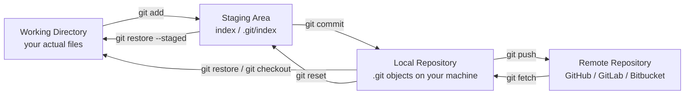
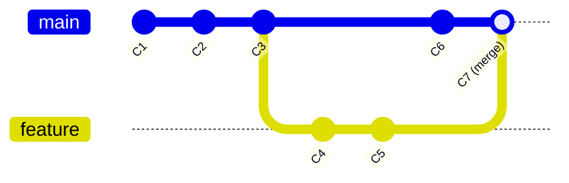
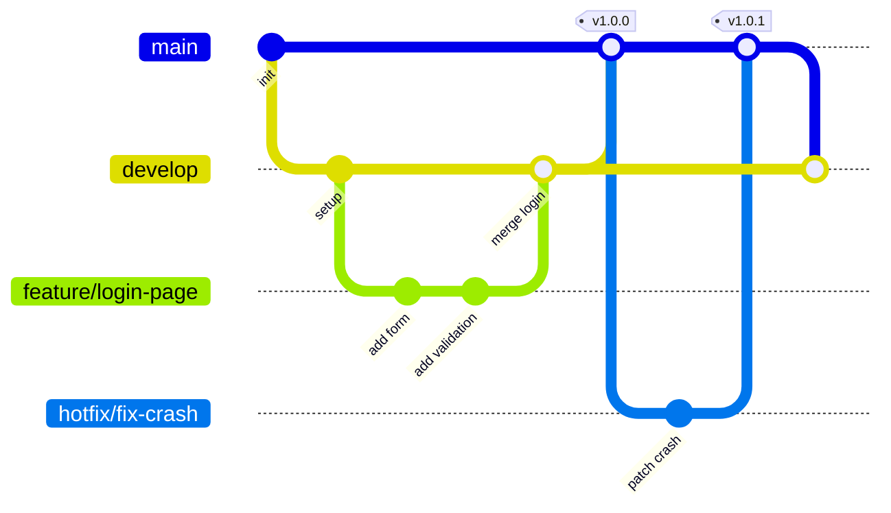
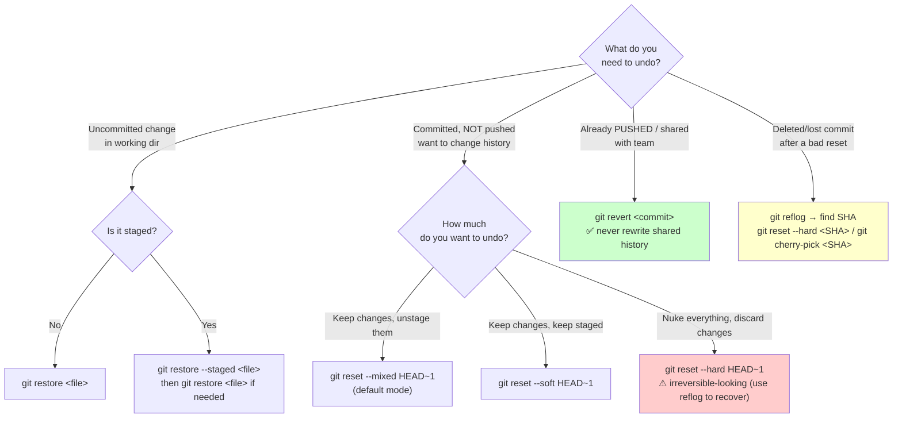

# Git Mastery Guide — From `git add .` to Team Pro

> You know `git add .` and `git commit -m`. This guide takes you from there to working like a senior engineer on a real team: branching strategy, rebasing, safe force-pushes, bisecting bugs, recovering "lost" work, and writing commits your team will actually thank you for.

---

## Table of Contents

1. [The Four Areas — How Git Actually Moves Your Code](#1-the-four-areas)
2. [Simple Commit Tree & Linear History](#2-simple-commit-tree--linear-history)
3. [Feature Branch Workflow](#3-feature-branch-workflow)
4. [The Undo Decision Tree](#4-the-undo-decision-tree)
5. [Complete Command Reference](#5-complete-command-reference)
6. [11 Must-Know Team Scenarios](#6-must-know-team-scenarios)
7. [Branch Naming Like a Pro](#7-branch-naming-like-a-pro)
8. [Commit Messages Like a Pro (+ Husky Template)](#8-commit-messages-like-a-pro)
9. [Golden Rules for Team Safety](#9-golden-rules)

---

## 1. The Four Areas

Every Git command you'll ever run moves a snapshot of your code between **four** places. Confusing these four is the #1 reason beginners panic.



**Mental model:**
- **Working Directory** — what you see in your editor right now.
- **Staging Area (Index)** — a "draft" of your next commit. `add` puts things here.
- **Local Repo** — permanent snapshots (commits) saved on your disk.
- **Remote Repo** — the shared source of truth your team pushes to / pulls from.

---

## 2. Simple Commit Tree & Linear History

Before branching gets complex, understand the basic shape: **a commit points to its parent commit**, a **branch is just a movable label** pointing at a commit, and **HEAD** is a pointer to whichever branch (or commit) you currently have checked out.



**How history moves, step by step:**
1. `C1 → C2 → C3` — this is `main` moving forward **linearly**, one commit at a time. Each new commit's parent is the previous tip.
2. `branch feature` at `C3` — this just creates a new label pointing at `C3`. No new commit is made yet.
3. `C4 → C5` on `feature` — `main` does NOT move. Only the `feature` label advances. `main` still points at `C3`.
4. `C6` on `main` — now `main` and `feature` have **diverged**: they share `C1-C2-C3` as common history, but each has its own new commits.
5. `merge feature` → `C7` — a new commit is created with **two parents** (`C6` and `C5`), reuniting the two lines of history back into `main`.

**Key takeaways:**
- A **linear** history (like `C1→C2→C3`) means every commit has exactly one parent — clean and easy to read.
- A **branch** is cheap: it's just a 41-byte pointer, not a copy of your code.
- `HEAD` moves when you `switch`/`checkout`; a **branch label** moves when you `commit` while that branch is checked out.
- `git log --oneline --graph --all` is how you *see* this exact tree in your terminal.

---

## 3. Feature Branch Workflow

The standard team model: `main` (production), `develop` (integration, optional), short-lived `feature/*` branches, and `hotfix/*` for emergencies.



**Flow in words:**
1. `feature/*` branches off `develop` (or `main` if no develop branch).
2. Work happens in small commits, rebased onto latest `develop` regularly.
3. PR opened → reviewed → squash/merge into `develop`.
4. `develop` periodically merges into `main` for releases (tagged).
5. `hotfix/*` branches off `main` directly for emergencies, merges back into **both** `main` and `develop`.

---

## 4. The Undo Decision Tree

The most feared part of Git. This tree removes the guesswork.



**Rule of thumb:** `restore` = working dir / staging only. `reset` = rewrites *local* history (safe, private branches only). `revert` = the *only* safe way to undo something already pushed/shared.

---

## 5. Complete Command Reference

### Setup & Config

| Command | What It Does | Real Team Scenario | Example |
|---|---|---|---|
| `git config --global user.name` | Sets your commit author name globally | Onboarding a new laptop before your first commit | `git config --global user.name "Aditi Sharma"` |
| `git config --global user.email` | Sets your commit author email | Must match your GitHub/GitLab account so commits link to your profile | `git config --global user.email "aditi@company.com"` |
| `git init` | Creates a new local Git repo | Starting a brand-new microservice from scratch | `git init my-service` |
| `git clone` | Copies a remote repo + full history to your machine | Joining a new team, pulling down the main codebase | `git clone git@github.com:org/repo.git` |

### Core Snapshotting

| Command | What It Does | Real Team Scenario | Example |
|---|---|---|---|
| `git status` | Shows staged/unstaged/untracked files | Sanity check before every commit — "what am I about to commit?" | `git status` |
| `git add -p` | Interactively stage **hunks**, not whole files | You fixed a bug AND left a `console.log` in the same file — commit only the fix | `git add -p src/auth.js` |
| `git diff` | Shows unstaged changes vs last commit | Reviewing your own edits before staging | `git diff` |
| `git diff --staged` | Shows staged changes vs last commit | Final review before hitting commit, especially before a PR | `git diff --staged` |
| `git commit` | Saves staged snapshot to local history | Standard unit of work — one logical change | `git commit -m "feat(auth): add JWT refresh"` |
| `git commit --amend` | Edits the **last** commit (message and/or content) | You forgot to `git add` a file, or typo'd the message, and haven't pushed yet | `git commit --amend --no-edit` |

### Branching & Merging

| Command | What It Does | Real Team Scenario | Example |
|---|---|---|---|
| `git branch` | Lists local branches | Checking what branches exist before starting new work | `git branch -a` |
| `git switch` / `git checkout` | Moves you to an existing branch | Jumping back to `main` to review a teammate's PR locally | `git switch develop` |
| `git switch -c` | Creates + switches to a new branch in one step | Starting a new ticket | `git switch -c feature/JIRA-231-cart-total` |
| `git merge` | Combines another branch into current one (fast-forward if possible) | Merging a finished feature into `develop` | `git merge feature/cart-total` |
| `git merge --no-ff` | Forces a merge commit even if fast-forward is possible | Keeping a visible "bubble" per feature in team history for traceability | `git merge --no-ff feature/cart-total` |
| `git rebase` | Replays your commits on top of another branch's tip | Updating your feature branch with latest `main` without a merge-commit mess | `git rebase main` |
| `git rebase -i` | Interactive rebase — reorder, squash, edit, drop commits | Cleaning up 8 messy "wip" commits into 1-2 clean commits before a PR | `git rebase -i HEAD~8` |
| `git cherry-pick` | Applies one specific commit from another branch | Hotfix commit made on `feature/x` by mistake needs to go to `main` too | `git cherry-pick a1b2c3d` |
| `git branch -d` | Deletes a branch (safe — refuses if unmerged) | Cleaning up after a feature branch was merged | `git branch -d feature/cart-total` |
| `git branch -D` | Force-deletes a branch (even if unmerged) | Abandoning an experimental branch that never shipped | `git branch -D spike/redis-poc` |

### Remote & Team

| Command | What It Does | Real Team Scenario | Example |
|---|---|---|---|
| `git remote -v` | Lists remotes and their URLs | Confirming you're pushing to the correct fork/org | `git remote -v` |
| `git fetch` | Downloads remote history WITHOUT merging | Checking what teammates pushed before deciding how to integrate | `git fetch origin` |
| `git pull` | `fetch` + `merge` in one step | Standard daily sync with `main` | `git pull origin main` |
| `git pull --rebase` | `fetch` + `rebase` instead of merge | Keeping history linear when syncing your feature branch | `git pull --rebase origin main` |
| `git push` | Uploads your commits to remote | Sharing finished work with the team | `git push origin feature/cart-total` |
| `git push -u` | Push + set upstream tracking branch | First push of a brand-new local branch | `git push -u origin feature/cart-total` |
| `git push --force-with-lease` | Force-push, but ONLY if no one else has pushed since your last fetch | After rebasing/squashing your **own** feature branch before a PR update | `git push --force-with-lease origin feature/cart-total` |

### History & Inspection

| Command | What It Does | Real Team Scenario | Example |
|---|---|---|---|
| `git log --oneline --graph --all` | Compact visual tree of all branches | Understanding how messy the branch history has become | `git log --oneline --graph --all` |
| `git log -p` | Shows full diff for each commit | Deep-diving into how a feature evolved | `git log -p src/payment.js` |
| `git log --stat` | Shows files changed + line counts per commit | Quick scan of "how big was this change" | `git log --stat -5` |
| `git show` | Shows full details of one commit | Reviewing exactly what a specific commit changed | `git show a1b2c3d` |
| `git checkout <hash>` | Detached HEAD — inspect an old commit | Checking how a file looked 3 releases ago, without changing branches | `git checkout a1b2c3d -- src/utils.js` |
| `git blame` | Shows who last touched each line | Finding out who introduced a suspicious line before asking them about it | `git blame src/auth.js` |
| `git blame -L` | `blame` limited to a line range | Zooming into just the function that's broken | `git blame -L 40,60 src/auth.js` |
| `git reflog` | Local log of EVERY HEAD movement (even resets) | Your safety net — recovering commits after a bad `reset --hard` | `git reflog` |
| `git bisect` | Binary search across commits to find a bug | Finding exactly which of 200 commits introduced a regression | `git bisect start` |
| `git shortlog` | Summarized commit log grouped by author | Writing a release changelog by contributor | `git shortlog -sn v1.0.0..v1.1.0` |
| `git tag` | Marks a specific commit (usually a release) | Tagging `v2.3.0` for production release | `git tag -a v2.3.0 -m "Release 2.3.0"` |

### File History & Branch Comparison (Often Forgotten, Very Handy)

| Command | What It Does | Real Team Scenario | Example |
|---|---|---|---|
| `git log --oneline <branch>` | Shows commit history of one specific branch only | Reviewing exactly what a teammate's branch contains before reviewing their PR | `git log --oneline feature/cart-total` |
| `git log <branch> --not <other-branch>` | Shows commits **unique to** `<branch>` that `<other-branch>` doesn't have | Checking exactly what your feature branch will add to `main` before merging | `git log feature/cart-total --not main` |
| `git log branchA..branchB` | Same idea — commits reachable from `branchB` but not `branchA` | Quick "what's new on develop since I branched off" check | `git log main..feature/cart-total` |
| `git checkout <commit-id>` | Detaches HEAD and checks out an old commit entirely | Jumping back to inspect the whole codebase as it looked at that point, then returning | `git checkout a1b2c3d` then `git switch -` |
| `git log -- <file>` | Shows every commit that touched a specific file | "Who has ever changed this file and why?" during a bug investigation | `git log -- src/payment.js` |
| `git log --follow -- <file>` | Same as above, but follows the file through renames | Tracing a file's full history even after it was renamed/moved | `git log --follow -- src/helpers.js` |
| `git log -p -- <file>` | Full diff history of one file, commit by commit | Understanding exactly how a function evolved over months | `git log -p -- src/auth.js` |
| `git log --stat -- <file>` | Compact change-size history of one file | Quick scan of how often/how much a file has changed | `git log --stat -- src/auth.js` |
| `git log --diff-filter=A -- <file>` | Finds the commit that **created** a file | "Who originally wrote this file, and when?" | `git log --diff-filter=A -- src/auth.js` |
| `git show <commit>:<file>` | Prints a file's exact content as of a specific commit | Comparing an old version of a config file without checking it out | `git show a1b2c3d:src/config.js` |
| `git log --author="name"` | Filters commit history by author | Reviewing everything one teammate has shipped this sprint | `git log --author="Aditi"` |
| `git log --grep="keyword"` | Filters commits by message content | Finding the commit that mentions a specific ticket or bug | `git log --grep="JIRA-482"` |
| `git diff branchA..branchB` | Diffs the tip of two branches directly | Sanity-checking exactly what will change if you merge `feature` into `main` | `git diff main..feature/cart-total` |
| `git diff branchA...branchB` | Diffs from the **common ancestor** (three dots) — ignores unrelated changes on `branchA` | Reviewing only *your* feature's changes, even if `main` moved on since you branched | `git diff main...feature/cart-total` |
| `git merge-base branchA branchB` | Finds the common ancestor commit of two branches | Figuring out exactly where two diverged branches split | `git merge-base main feature/cart-total` |
| `git branch --merged` | Lists branches already merged into current branch | Safely finding which feature branches are done and can be deleted | `git branch --merged main` |
| `git branch --no-merged` | Lists branches NOT yet merged | Auditing what's still in-flight before a release | `git branch --no-merged main` |
| `git branch -vv` | Shows each local branch with its tracked remote + ahead/behind count | Quick check of "am I behind origin/main?" across all your local branches | `git branch -vv` |
| `git fetch --prune` | Deletes local references to remote branches that no longer exist | Cleaning up stale branch clutter after teammates delete their merged PR branches | `git fetch --prune` |
| `git push origin --delete <branch>` | Deletes a branch on the remote | Cleaning up the remote after a feature branch is merged | `git push origin --delete feature/cart-total` |

### Undoing & Fixing

| Command | What It Does | Real Team Scenario | Example |
|---|---|---|---|
| `git restore <file>` | Discards uncommitted working-dir changes | You messed up a file and want the last-committed version back | `git restore src/config.js` |
| `git restore --staged <file>` | Unstages a file, keeps the edits | You ran `git add .` too early and want to exclude one file | `git restore --staged .env` |
| `git reset --soft HEAD~1` | Undoes last commit, keeps changes staged | You committed too early, want to add more before re-committing | `git reset --soft HEAD~1` |
| `git reset --mixed HEAD~1` | Undoes last commit, unstages changes (default) | You want to re-group your changes into different commits | `git reset HEAD~1` |
| `git reset --hard HEAD~1` | Undoes last commit AND discards all changes | Throwing away an entire broken commit on a **local, unpushed** branch | `git reset --hard HEAD~1` |
| `git revert <commit>` | Creates a NEW commit that undoes a previous one | Undoing a bug that's already live on `main`, safely, without rewriting history | `git revert a1b2c3d` |
| `git rm` | Removes a file from working dir + stages the deletion | Removing a file that should never have been committed (not secrets — see below) | `git rm old-config.json` |
| `git mv` | Renames/moves a file and stages it | Renaming a module during a refactor | `git mv utils.js helpers.js` |

### Stashing & Cleaning

| Command | What It Does | Real Team Scenario | Example |
|---|---|---|---|
| `git stash push` | Shelves uncommitted changes, cleans working dir | An urgent hotfix request lands while you're mid-feature | `git stash push -m "wip cart discount logic"` |
| `git stash list` | Lists all stashed changesets | Checking what you've stashed across the week | `git stash list` |
| `git stash apply` | Reapplies a stash, keeps it in the stash list | Testing stashed changes without losing the backup | `git stash apply stash@{0}` |
| `git stash pop` | Reapplies the latest stash AND removes it from the list | Resuming feature work after the hotfix is done | `git stash pop` |
| `git stash drop` | Deletes a stash without applying it | Cleaning up an old stash you no longer need | `git stash drop stash@{2}` |
| `git clean -n` | Dry-run: shows untracked files that WOULD be deleted | Safety check before nuking build artifacts | `git clean -n` |
| `git clean -fd` | Deletes untracked files AND directories | Wiping generated `node_modules`/`dist` junk before a clean rebuild | `git clean -fd` |
| `git worktree` | Checks out multiple branches into separate folders simultaneously | Reviewing a PR in one folder while still coding in your feature branch in another | `git worktree add ../review-branch feature/x` |
| `git submodule` | Manages a nested Git repo inside your repo | Your project depends on a shared internal library repo | `git submodule update --init --recursive` |

---

## 6. Must-Know Team Scenarios

### Scenario 1 — Start a New Feature Properly

```bash
git switch main
git pull origin main
git switch -c feature/JIRA-482-checkout-discount
# ...work, commit incrementally...
git push -u origin feature/JIRA-482-checkout-discount
```

### Scenario 2 — Update Your Feature Branch with `main` (Rebase)

```bash
git switch feature/JIRA-482-checkout-discount
git fetch origin
git rebase origin/main
# resolve any conflicts, then:
git add .
git rebase --continue
git push --force-with-lease origin feature/JIRA-482-checkout-discount
```

### Scenario 3 — Squash Messy Commits Before a PR

```bash
git log --oneline          # see the 6 messy "wip" commits
git rebase -i HEAD~6
# in editor: keep first as "pick", change rest to "squash" (or "s")
# save, write final clean commit message, save again
git push --force-with-lease origin feature/JIRA-482-checkout-discount
```

### Scenario 4 — Go to a Particular Commit and Come Back

```bash
git log --oneline                  # find the SHA, e.g. a1b2c3d
git checkout a1b2c3d               # detached HEAD, inspect freely
# look around, run tests, etc — do NOT commit here
git switch -                       # jump back to your previous branch
```

### Scenario 5 — Revert a Commit Already Pushed (Team-Safe)

```bash
git log --oneline                  # find the bad commit SHA
git revert a1b2c3d                 # creates a NEW commit undoing it
git push origin main
# NEVER git reset --hard + force-push on a shared branch like main
```

### Scenario 6a — Find Who Broke a Line (`blame`)

```bash
git blame -L 40,60 src/checkout.js
# note the SHA next to the suspicious line
git show <that-SHA>                # see full context/message/author
```

### Scenario 6b — Find the Bug-Introducing Commit (`bisect`)

```bash
git bisect start
git bisect bad                     # current commit is broken
git bisect good v1.4.0             # this old tag was known-good
# Git checks out a midpoint commit — test it, then:
git bisect good                    # or: git bisect bad
# repeat until Git names the exact culprit commit
git bisect reset                   # return to your original branch
```

### Scenario 7 — Recover a Lost Commit After `reset --hard`

```bash
git reflog                         # find the SHA before the reset, e.g. HEAD@{2}
git reset --hard HEAD@{2}          # restore to that state
# or, safer if unsure:
git cherry-pick <lost-SHA>         # bring back just that one commit
```

### Scenario 8 — Handle an Urgent Hotfix Mid-Feature (Stash)

```bash
git stash push -m "wip: discount logic"
git switch main
git pull origin main
git switch -c hotfix/checkout-crash
# ...fix, commit, push, open PR, merge...
git switch feature/JIRA-482-checkout-discount
git stash pop
```

### Scenario 9 — Fix the Wrong Branch (Cherry-Pick)

```bash
# You committed a hotfix directly on your feature branch by mistake
git log --oneline -1               # copy the SHA
git switch main
git cherry-pick <SHA>
git push origin main
# optionally remove it from the feature branch via interactive rebase
```

### Scenario 10 — Undo a Bad `git add .` Before Committing

```bash
git status                         # see everything staged, including .env by accident
git restore --staged .env
echo ".env" >> .gitignore
git add .gitignore
git commit -m "chore: ignore local env file"
```

### Scenario 11 — Trace a File's Full History (Who Created It, Every Change Since)

```bash
# Who created this file, and when?
git log --diff-filter=A -- src/payment.js

# Every commit that ever touched it (follows renames too)
git log --follow --oneline -- src/payment.js

# Full diff history, commit by commit
git log --follow -p -- src/payment.js

# See its exact content as of one specific old commit
git show a1b2c3d:src/payment.js

# Who wrote each current line, right now
git blame src/payment.js
```

---

## 7. Branch Naming Like a Pro

**Format:** `<type>/<ticket-id>-<short-kebab-description>`

| Type | Use For | Example |
|---|---|---|
| `feature/` | New functionality | `feature/JIRA-482-checkout-discount` |
| `fix/` | Non-urgent bug fix | `fix/JIRA-501-null-pointer-cart` |
| `hotfix/` | Urgent production fix | `hotfix/payment-gateway-timeout` |
| `chore/` | Tooling, deps, config, no user-facing change | `chore/upgrade-node-20` |
| `refactor/` | Code restructure, no behavior change | `refactor/extract-auth-service` |
| `release/` | Preparing a release branch | `release/v2.3.0` |
| `spike/` | Exploration/proof-of-concept, may be discarded | `spike/redis-caching-poc` |

**Rules:**
- Lowercase, hyphens not underscores or spaces.
- Include the ticket ID so it's traceable to a task tracker.
- Keep the description short — 3–5 words max.
- Never name a branch after yourself (`john-fixes` ❌) — name it after the *work*.

---

## 8. Commit Messages Like a Pro

Use **Conventional Commits** — required if you're using **Husky** + **commitlint** for pre-commit/commit-msg hooks.

### Template

```
<type>(<scope>): <short summary, imperative mood, no period>

<body — the WHY, not the what; wrap at 72 chars>

<footer — breaking changes, issue refs>
```

### Types

| Type | Meaning |
|---|---|
| `feat` | New feature |
| `fix` | Bug fix |
| `docs` | Documentation only |
| `style` | Formatting, no logic change (whitespace, semicolons) |
| `refactor` | Code change that neither fixes a bug nor adds a feature |
| `perf` | Performance improvement |
| `test` | Adding or fixing tests |
| `chore` | Build process, tooling, dependencies |
| `ci` | CI/CD config changes |
| `revert` | Reverts a previous commit |

### Real Examples

```
feat(checkout): add promo code discount calculation

Applies percentage or flat discounts before tax calculation.
Needed for the Q4 marketing campaign launch.

Closes JIRA-482
```

```
fix(auth): prevent token refresh race condition

Two concurrent requests could both trigger a refresh, invalidating
each other's token. Added a mutex lock around the refresh call.

Fixes JIRA-501
```

```
refactor(cart)!: rename getTotal() to calculateTotal()

BREAKING CHANGE: getTotal() is removed; update all call sites to
use calculateTotal() instead.
```

### Husky + Commitlint Setup (so bad commits are blocked automatically)

```bash
npm install --save-dev husky @commitlint/cli @commitlint/config-conventional
npx husky init
echo "npx --no -- commitlint --edit \$1" > .husky/commit-msg
```

`commitlint.config.js`:
```javascript
module.exports = { extends: ['@commitlint/config-conventional'] };
```

Now any commit that doesn't follow `type(scope): summary` format is **rejected before it's created** — no messy history reaches the team.

---

## 9. Golden Rules

1. **Never rewrite public history.** Once a commit is pushed and others may have pulled it, don't `rebase`, `reset --hard`, or `commit --amend` it — use `revert` instead.
2. **`--force-with-lease`, never plain `--force`.** It fails safely if a teammate pushed to your branch since you last fetched; plain `--force` overwrites blindly.
3. **Pull before you push. Fetch before you rebase.** Always know the remote state before acting on it.
4. **Commit small, commit often, squash before merging.** Small local commits are cheap checkpoints; the PR history should be clean.
5. **One logical change per commit.** If your commit message needs "and" to describe it, split it.
6. **Never commit secrets.** `.env`, API keys, credentials — use `.gitignore` from day one; if leaked, rotate the secret (removing from history isn't enough).
7. **`main`/`production` branches are protected.** No direct pushes — always via reviewed PR.
8. **`reflog` is your safety net, not an excuse to be careless.** Know it exists, but still treat `reset --hard` with respect.
9. **Write commit messages for the next engineer at 2 AM debugging prod**, not for yourself right now.
10. **When in doubt, branch off and experiment.** Branches are free — never fear making one to test an idea.
11. **Clean up after yourself.** Once a branch is merged, delete it both locally (`git branch -d`) and remotely (`git push origin --delete`) — run `git fetch --prune` regularly so your branch list reflects reality.
12. **Before merging, always check `branchA...branchB` (three dots), not just `branchA..branchB`.** Three dots isolates *only* your feature's real changes from the common ancestor — two dots can mislead you if `main` has moved on.

---

*Keep this file in your repo as `GIT_GUIDE.md` — it doubles as team onboarding documentation.*